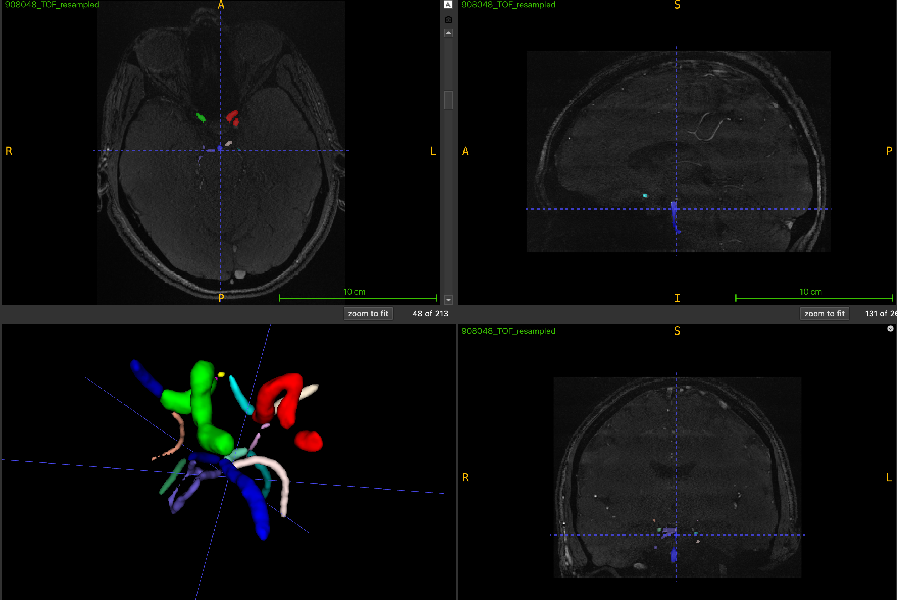
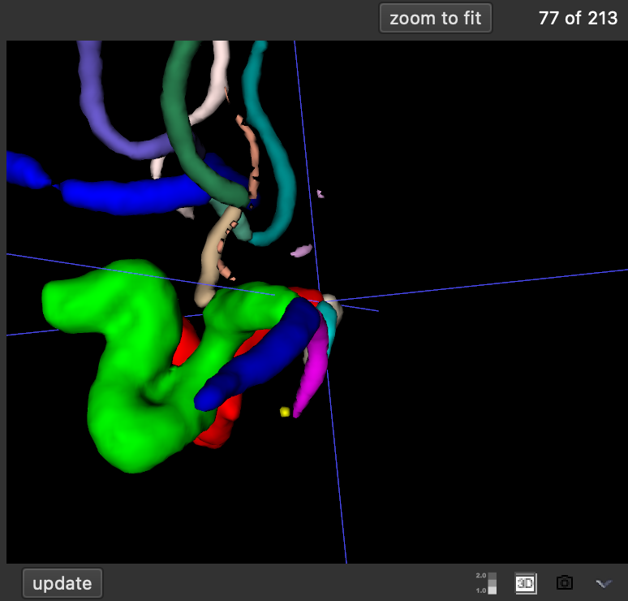
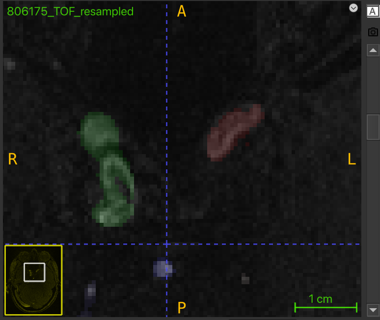
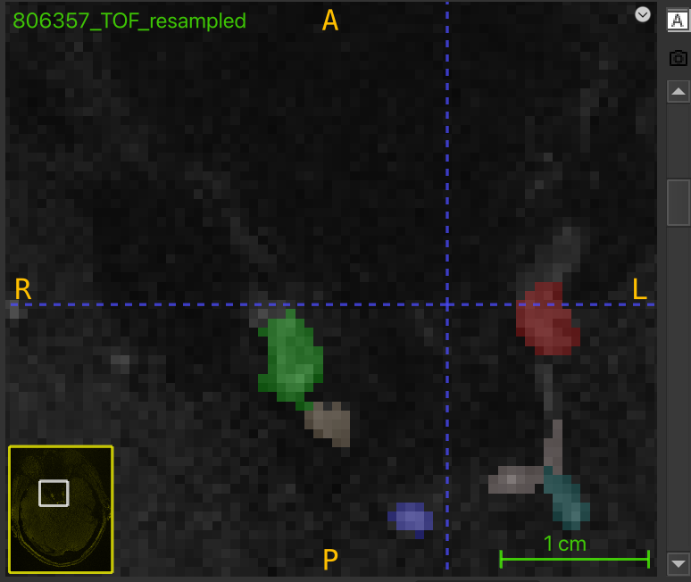

## Table of Contents

- [Table of Contents](#table-of-contents)
- [Introduction](#introduction)
- [Why Perform QA on TOF Segmentation of the Circle of Willis?](#why-perform-qa-on-tof-segmentation-of-the-circle-of-willis)
- [Steps to Begin QA](#steps-to-begin-qa)
- [Loading Images into ITK-SNAP](#loading-images-into-itk-snap)
- [Editing the Segmentation](#editing-the-segmentation)
- [Common Errors to Correct](#common-errors-to-correct)
- [Post-QA Steps](#post-qa-steps)
   
## Introduction  
This QA process is essential for the `vseg2tortuosity` pipeline, hosted at ([add GitHub link](https://github.com/tetra-tools/vseg2tortuosity)). The pipeline utilizes skeletonized segmentation to fit splines and derives tortuosity metrics from the curvature of the splines.  

## Why Perform QA on TOF Segmentation of the Circle of Willis?  
Low-quality segmentation, such as discontinuities in segmenting the Internal Carotid Artery (ICA), can lead to poor skeletonization and inaccurately fitted splines. This, in turn, negatively impacts the derived tortuosity metrics.  

## Steps to Begin QA  
1. **Download Segmentation Files**:  
   - Retrieve the relevant NIfTI files for the participant from our server as a zip file.  
   - Unzip the file and work on a local copy of the original data.  

2. **Post-QA File Management**:  
   - Save your edits with your initials and the date, e.g., `YP_123024_QA_RAW`.  
   - Upload the corrected files to your designated workspace on the server at `/mnt/WorkSpaces/Your_Name`.  

3. **Documentation**:  
   - Record participant ID, QA completion date, and your initials in an Excel file. Example:  

     | Participant ID | QA Date  | Initials |  
     |----------------|----------|----------|  
     | 806175         | 12/30/24 | YP       |  

---

## Loading Images into ITK-SNAP  
For each participant, you will work with two files:  
- **`TOF_resampled.nii.gz`**: TOF image of the participant.  
- **`TOF_eICAB_CW.nii.gz`**: Segmentation of the Circle of Willis corresponding to the TOF image.  

1. **Load the Resampled Image**:  
   - Open ITK-SNAP and drag the `TOF_resampled.nii.gz` file into the interface.  

2. **Add the Segmentation**:  
   - Drag the `TOF_eICAB_CW.nii.gz` file into ITK-SNAP.  
   - When prompted, select "Load as Segmentation."  

3. **Update the View**:  
   - Click the `Update` button at the bottom left to display the segmentation in 3D.  

---

## Editing the Segmentation  

Use the Paintbrush Tool  
1. Activate the **Paintbrush Mode**:  
   - In the left toolbar, click the 4th icon (Paintbrush Mode).  

2. Configure the Paintbrush:  
   - Choose a brush size of 1 or 2 for greater precision.  

3. Select the Label:  
   - Label 1 (Red): Left ICA.  
   - Label 2 (Green): Right ICA.  
   - **Clear Label (Black)**: Used as an eraser.  

4. Edit the Segmentation:  
   - Work primarily in the upper-left panel (assumes a 2×2 panel layout).  
   - After making changes, click `Update` to verify edits in the 3D view.  

---

## Common Errors to Correct  

1. **Discontinuities in Left/Right ICA**:  
   - Look for breaks in the vessel path.  

2. **Sticking Vessels**:  
   - Ensure vessels do not erroneously merge.  

3. **Missing Coverage**:  
   - Add missing pixels by tracing brighter areas in the TOF image.  

Examples:  
- **Discontinuity Example**:  
    
- **Overlapping Segments**:  
    
- **Correcting Missing Pixels**:  
Follow brighter pixels to trace vessel peripheries.  Add pixels to labels as needed:  
    
    

---

## Post-QA Steps  

1. Save the corrected segmentation in a folder named with your initials and the QA date (e.g., `YP_123024_QA_RAW`).  
2. Upload the folder to your workspace on the server at `/mnt/WorkSpaces/Your_Name`.  
3. Update the QA record in the Excel file.  
