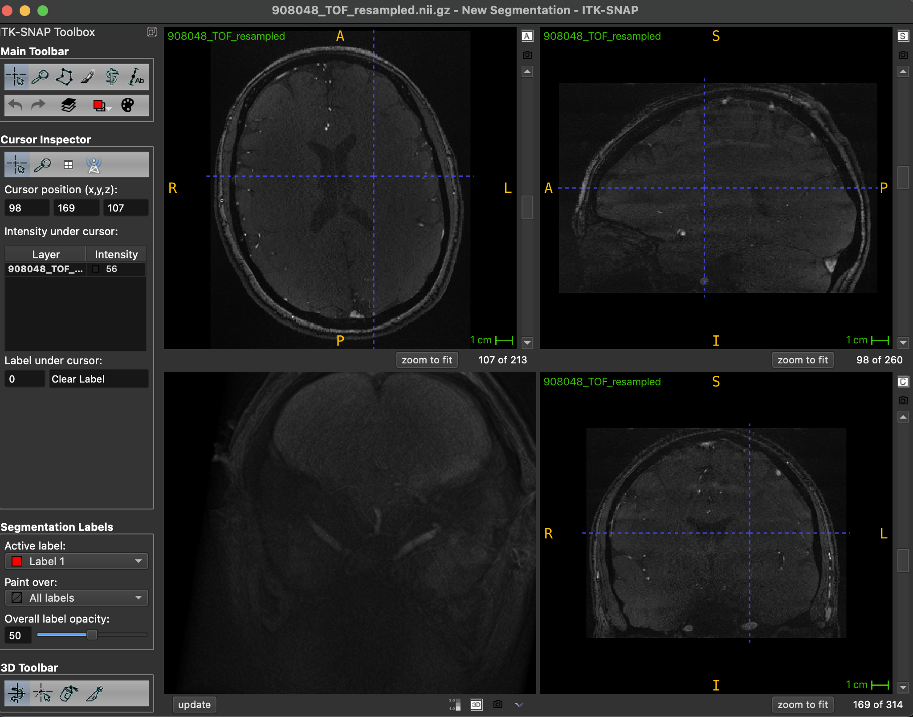
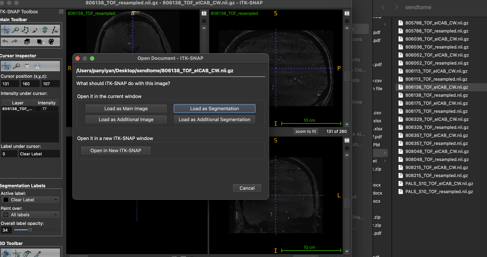
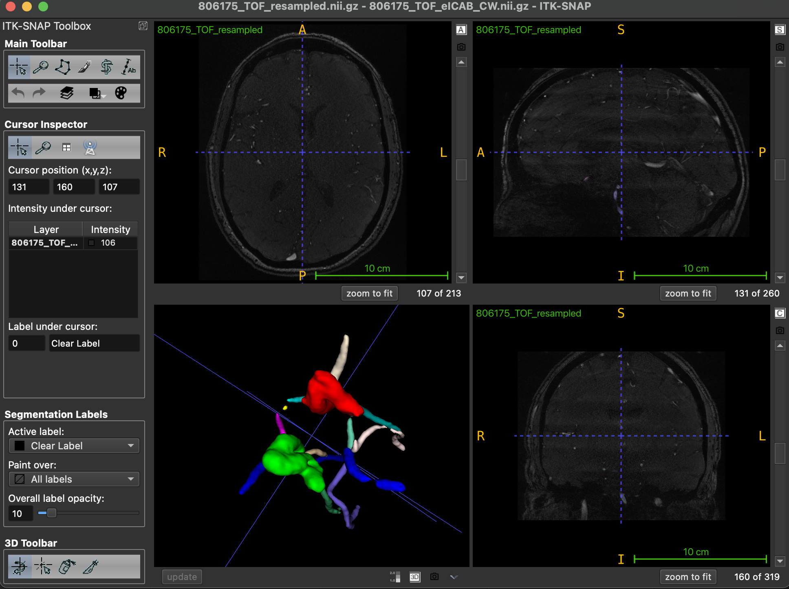
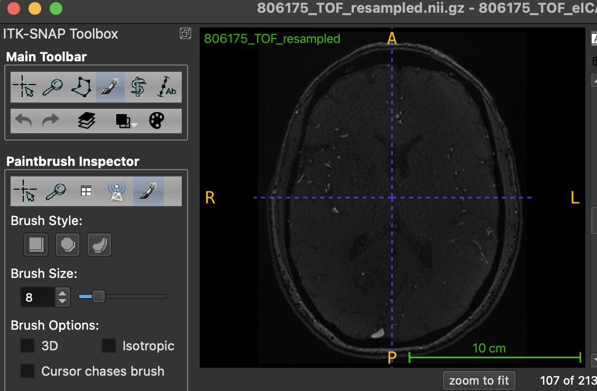
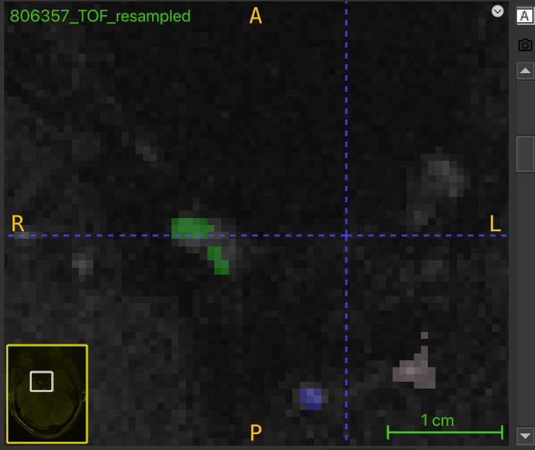
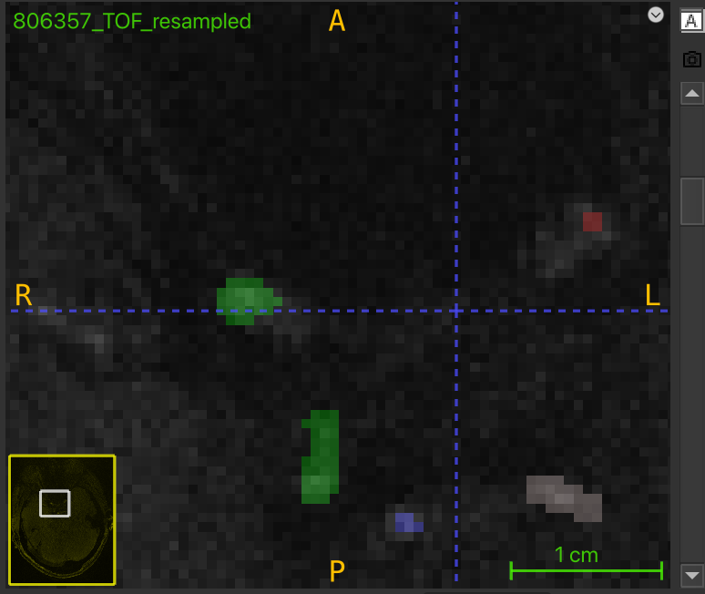

# SOP for Quality Assurance of TOF segmentation for RAW 

## Introduction
This QA process is required for vseg2tortuosity pipeline at (add github link). This pipeline uses skeletonized segmentation to fit spline and uses the curvature of spline to derive tortuosity metrics. 

## Why do we need QA on TOF segmentation of Circle of Willis 
low quality segmentation e.g. discontinuity in segmenting ICA could lead to bad skeletonization and resulting in very poorly fitted spline. 

## How to do QA on TOF Circle of Willis Segmentation
we use itk-snap to do the quality assurance. you should download the nifti files for participant you are doing quality assurance on (we will have a excel table for it) from our server as a zip file, unzip this file and work on this local copy of the original data. after finishing your edits, you can save the files with your initials and date and put it under `/mnt/WorkSpaces/Your_Name` on our server.

**how to load input image**
For each subject with subject id `806175` without loss of generality, we have 2 corresponding images: `806175_TOF_resampled.nii.gz` (the TOF image of the particiapnt) and `806175_TOF_eICAB_CW.nii.gz` (the segmentation of Cirlce of Willis correspond to that TOF image). 

* step 1: We load the resampled image as main image first by opening itk-snap and drag this image to itksnap.  

* step 2: we then add the corresponding segmentation by dragging the eICAB_CW image to itk-snap, a prompt box will pop up asking how do we like to load this image, select load as segmentation.

* step 3: click the `update` button in the bottom left. after clicking it, you will see the segmentation in 3d. 

**how to use paintbrush tool to correct segmentation**
we uses `itk-snap` to do quality assurance by adding and removing pixels at where the automatic segmentation of left and right ICA (Internal Carotid Artery) fails.

after loading the images, go to main tool bar on the left side of the itk-snap and click the 4th icon named paint brush mode. 

In the Paintbrush Inspector column below, you can choose any brush style you want but i recommand keeping brush size to be either 1 or 2 for greater precision. 

in segmentation column, you can choose which label your current paintbrush is using. We only need Label 1 (red, left ICA), Label 2 (green, right ICA), and Clear Label(black) since we are only focusing on doing quality assurance on ICA and we use Clear label as an eraser. 

you will typically edit in upper left panel (assume we have 2*2 panels), after adding or removing some pixels, click update button again to check how these changes reflect in the 3d-segmentation as a sanity check that you are editing in the place you desired. 

**what error to correct in the segmenation**
you should look for obvious discontinuity in left and right ica and cases when a vessel seems to stick together. you check this in 3d view of the segmentation

try follow the brigher pixel in the tof as trace when deciding which part of the image should be in segmentation and which part should not. for example here, you might want to remove some of the pixel on the green label 

you might want to add some pixel to both red and green label in this example 

red label is clearly missing in this example, you can trace the peripheral of the ICA by following the ligher pixel using your penbrush tool. 

red label is present but the coverage is very poor. you could add more pixel to red label here.
